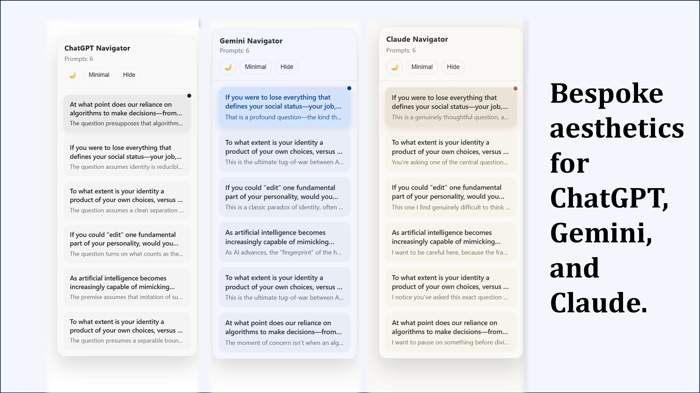
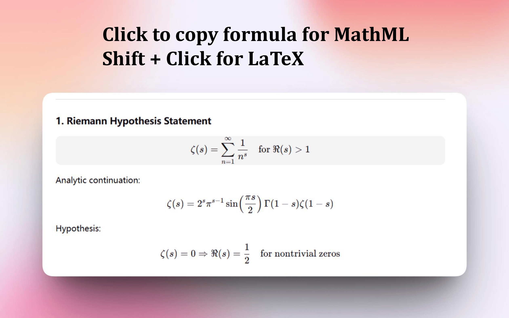
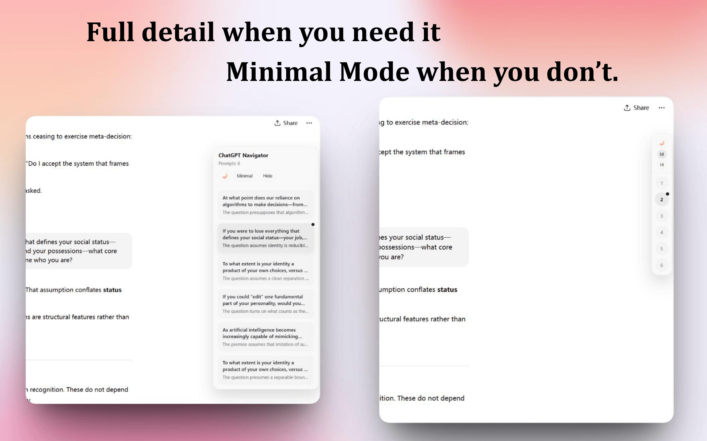
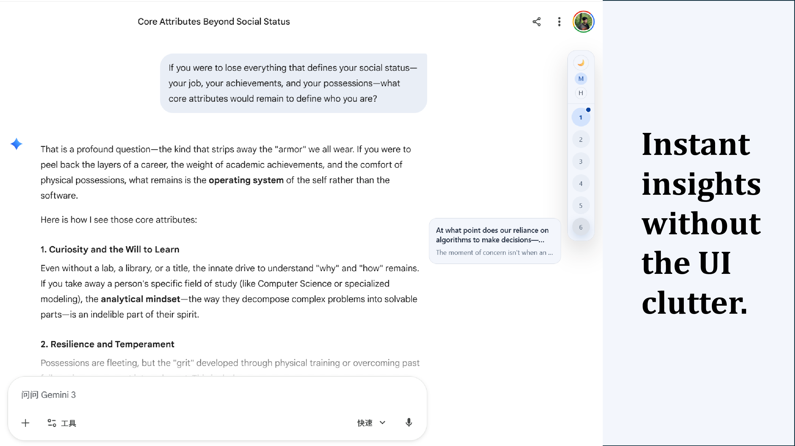
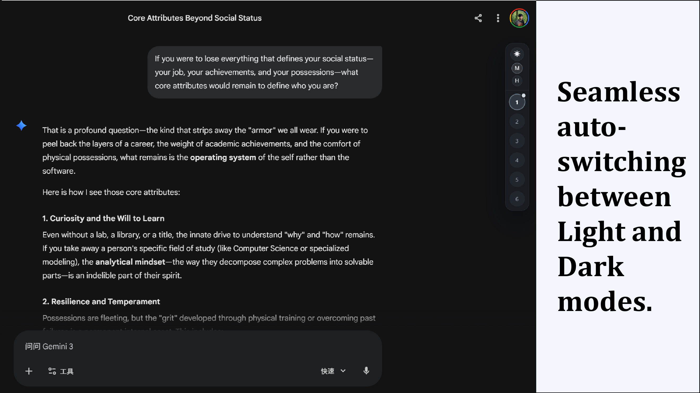

  

# JumpNav

JumpNav is a floating side navigator for **ChatGPT, Gemini, and Claude**.
It turns long conversations into clickable outlines with prompt and reply previews, so you can jump back to key context in seconds.

**Language:** [简体中文](README.md) | **English**

> Current Version: **v2.0.0**

## Chrome Web Store (Recommended)

Now live on the Chrome Web Store. Install from the store for automatic updates.

[JumpNav: The most elegant AI chat navigator you’ve ever seen.](https://chromewebstore.google.com/detail/chatgpt-gemini-quick-navi/kkemkfabmgjcjlileggigaaemcheapep)

## Core Value

- **Less scrolling, more thinking**: Convert long chats into structured navigation.
- **One-click jump**: Click an entry to smoothly return to the exact prompt location.
- **Low-distraction workflow**: Draggable floating panel with hide/show and position memory.

## Interface Preview

**Normal Mode**

**Minimal Mode**

**Interface Preview 3**

**Interface Preview 4**

**Interface Preview 5**

## Supported Sites

- `chatgpt.com`
- `gemini.google.com`
- `claude.ai`

## Acknowledgements

- The theme transition effect is inspired by [urzeye/ophel](https://github.com/urzeye/ophel).

## License

CC BY-NC-SA 4.0 (Creative Commons Attribution-NonCommercial-ShareAlike 4.0)

- ✅ Free to use, copy, modify, and distribute
- ✅ Must provide attribution
- ❌ Not for commercial use
- ✅ Derivatives must use the same license

Read more: [CC BY-NC-SA 4.0 License](https://creativecommons.org/licenses/by-nc-sa/4.0/)
