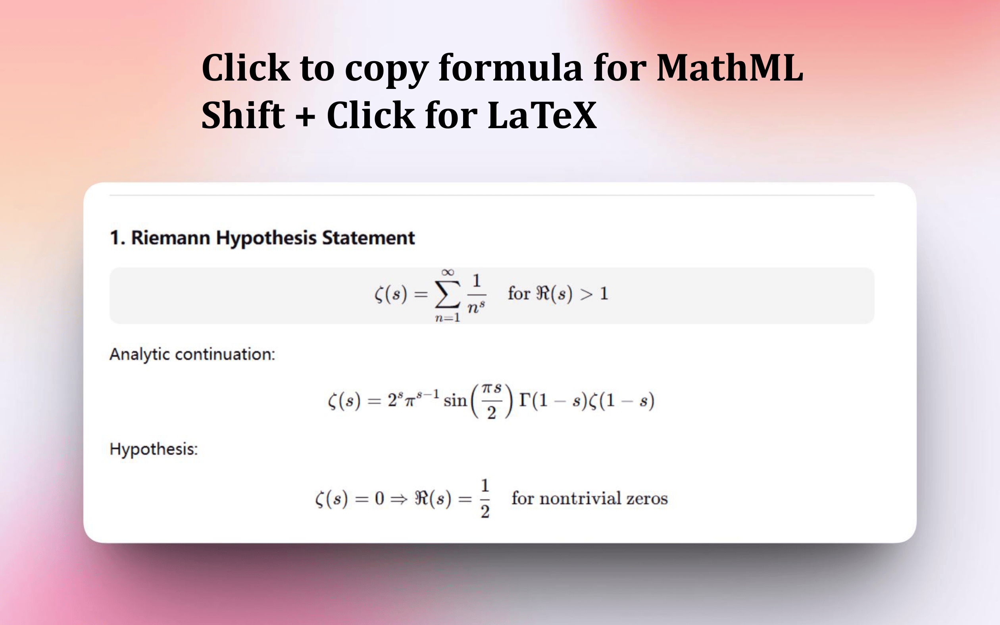
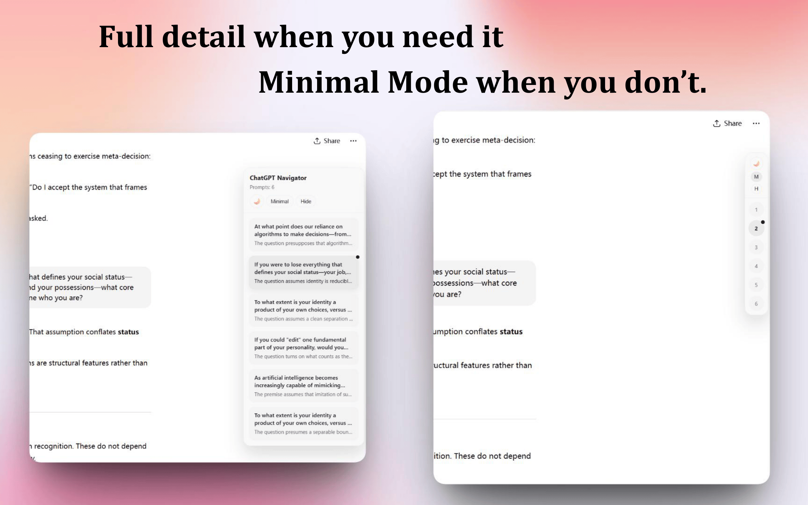
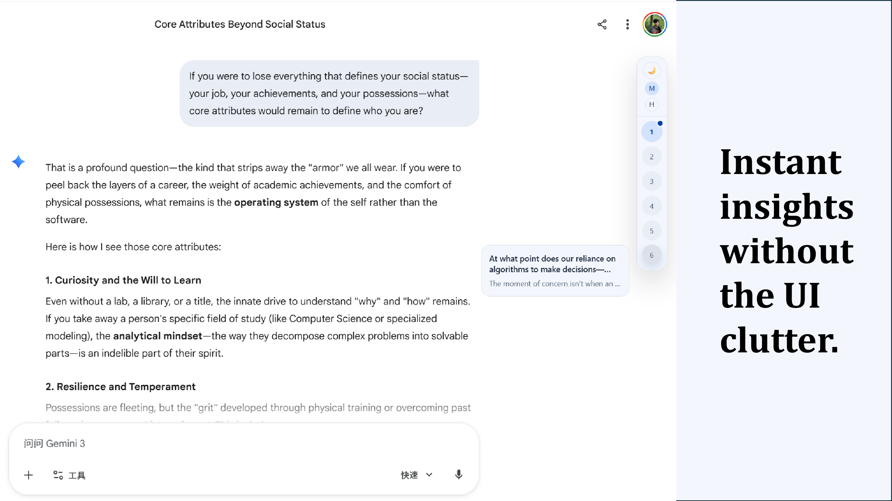
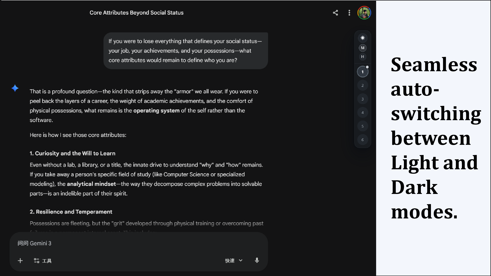

  

# JumpNav

JumpNav is a floating side navigator for **ChatGPT, Gemini, and Claude**.
It turns long conversations into clickable outlines with prompt and reply previews, so you can jump back to key context in seconds.

**Language:** [简体中文](README.md) | **English**

> Current Version: **v2.2.2**

## Updates in v2.2.2

- Added persistent collapsed state: after clicking `Hide`, the panel stays hidden after refresh; click `Fab` to reopen and persist state.
- Refactored the navigation core: split `core` into orchestration, navigation controller, and conversation indexer for lower coupling and better stability.
- Extracted shared site detection and formula-settings services so popup and content scripts use one configuration path.
- Unified formula extraction, conversion, and storage modules under consistent APIs to improve testability and future extensions.

## Chrome Web Store (Recommended)

Now live on the Chrome Web Store. Install from the store for automatic updates.

[JumpNav: The most elegant AI chat navigator you’ve ever seen.](https://chromewebstore.google.com/detail/chatgpt-gemini-quick-navi/kkemkfabmgjcjlileggigaaemcheapep)

## Core Value

- **Less scrolling, more thinking**: Convert long chats into structured navigation.
- **One-click jump**: Click an entry to smoothly return to the exact prompt location.
- **Low-distraction workflow**: Draggable floating panel with hide/show, plus persisted hidden state and position memory.

## Feature Checklist

- Automatically extracts user prompts and builds a clickable navigator for ChatGPT, Gemini, and Claude.
- Supports both mouse click and keyboard `Enter` / `Space` on navigator items.
- Tracks reading position in real time, highlights the active item, and keeps it visible in the list.
- Includes Minimal mode and Adaptive Minimal mode (auto-switch when panel overlaps conversation content).
- Shows reply preview on hover/focus in Minimal mode; click preview to jump directly.
- Supports one-click `Hide` / `Fab` reopen, persists collapsed state across refresh, and remembers `Fab` position.
- Supports light/dark theme switching and auto-sync with site theme changes (with transition animation).
- Rebuilds automatically on SPA route changes and streaming message updates.
- Formula click-to-copy supports MathML / LaTeX: default MathML, `Shift+Click` for LaTeX.
- MathML engine supports MathJax / KaTeX / Auto, configurable and persisted in popup settings.
- Includes robust formula extraction compatibility for KaTeX, MathJax, `data-math`, `annotation`, and similar structures.

## Interface Preview

**Normal Mode**

**Minimal Mode**

**Interface Preview 3**

**Interface Preview 4**

**Interface Preview 5**

## Supported Sites

- `chatgpt.com`
- `gemini.google.com`
- `claude.ai`

## Acknowledgements

- The theme transition effect is inspired by [urzeye/ophel](https://github.com/urzeye/ophel).

## License

CC BY-NC-SA 4.0 (Creative Commons Attribution-NonCommercial-ShareAlike 4.0)

- ✅ Free to use, copy, modify, and distribute
- ✅ Must provide attribution
- ❌ Not for commercial use
- ✅ Derivatives must use the same license

Read more: [CC BY-NC-SA 4.0 License](https://creativecommons.org/licenses/by-nc-sa/4.0/)
